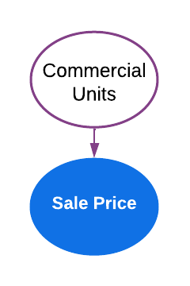

```{r setup and add libraries, include=FALSE, echo = FALSE, warning=FALSE, message = FALSE}
library(knitr)
library(tidyverse)
library(ggplot2)
library(stargazer)
library(sandwich)

opts_chunk$set(echo = TRUE)
```


```{r read data, echo = FALSE, message = FALSE, warning=FALSE}

#initial read. Skip lines with metadata
qns <- read.csv('./2019_queens.csv', skip = 4)
bk <- read.csv('./2019_brooklyn.csv', skip = 4)
bx <- read.csv('./2019_bronx.csv', skip = 4)
mn <- read.csv('./2019_manhattan.csv', skip = 4)
si <- read.csv('./2019_statenisland.csv', skip = 4)
census <- read.csv('./ACSST5Y2019.S1903_data_with_overlays_2021-12-10T101330.csv', skip =1)

#combine borough-level df into single df
ls <- list(qns, bk, bx, mn, si)
df <- do.call("rbind", ls)


#Remove commas from numerical values and convert to numeric type
df$SALE.PRICE. <- as.numeric(gsub(",","",df$SALE.PRICE.))
df$GROSS.SQUARE.FEET. <- as.numeric(gsub(",","",df$GROSS.SQUARE.FEET.))

#parse and format zip code and median income from census data
incomes <- census %>%
  select(Geographic.Area.Name, names(census)[163]) %>%
  separate(col = Geographic.Area.Name, into = c('remove', 'zipcode'), sep = " ") %>%
  select(-1) %>%
  rename('median.income' = 2)  %>%
  lapply(as.integer)

#Left join sales data with income by zipcode
df <- rename(df, zipcode = ZIP.CODE.)
df <- merge(df, incomes, by = 'zipcode', all.x = TRUE)

# Filter for two-dwelling house and rename columns
df <- df %>%
  filter(BUILDING.CLASS.CATEGORY. == '02 TWO FAMILY DWELLINGS',
         SALE.PRICE. > 405000,
         GROSS.SQUARE.FEET. > 1120) %>%
  rename(c(sqft = GROSS.SQUARE.FEET., commercial.units = COMMERCIAL.UNITS., 
           boro = BOROUGH., sale.price = SALE.PRICE., block = BLOCK., lot = LOT.,
           address =ADDRESS., apt = APARTMENT.NUMBER. ))

#covert datatypes
df$commercial.units <- as.factor(df$commercial.units )
df$zipcode <- as.factor(df$zipcode)

#change Borough codes into Borough names
df$boro <- as.factor(plyr::mapvalues(df$boro,c(1,2,3,4,5), 
                                     c("Manhattan", "Bronx", "Brooklyn",  
                                       "Queens", "Staten Island") ))

#create age variable for further evaluation
df$age <- 2019 - df$YEAR.BUILT.

#Remove Easement variable which has all NA's. 
#Leaving this would create errors when dropping NA's across entire dataframe
df <- df %>% select(-8) 

#Remove NA's and duplicate values
df <- na.omit(df)
df <- df[!duplicated(df),]

#Split dataset 30% for EDA and remaining 70% for model testing
#for EDA
set.seed(12345)
samplesize <- round(nrow(df)*(.3))
df_EDA <- df[sample(nrow(df), size = samplesize, replace = FALSE), ]

#for modeling
df_test <- setdiff(df, df_EDA)
```

# 1. Introduction

## 1.1 Motivation
Real estate is a long-standing investment vehicle that has been proven to build generational wealth. To secure the best sale price, it is common practice for property owners to make home improvements that increase the property value. For example, one may turn a three-bedroom house into a four-bedroom house or by adding an extra bathroom. New York City has a booming real estate market, which includes two-dwelling houses that are ideal for multi-tenant occupancy, and therefore, a source of passive income (see Figure 1 below for an example). Improving sales in this market requires us to understand the causal effect of various features on sale price. In this research project, we aim to analyze 2019 sales data and develop a statistical model to explain the effect of the addition of a commercial unit and other demographic factors to the sale price of a two-family dwelling house in New York City.

## 1.2 Research Question

Many two-family dwelling properties in New York City include a commercial unit on the bottom for businesses (see figure 1 for examples), so we have chosen to make this a focus of our research. Specifically, we aim to answer the question: 
How does the addition of a commercial unit impact the sale price of Two-Family Dwelling properties in New York City?


```{r, fig.show='hold',fig.align='center', out.width="49%", out.height="20%" , echo= FALSE, fig.cap = "Examples of two-family dwellings with a commercial unit (right) and without (left)"}

include_graphics(c('./images/dwelling_without_commercial.png', './images/dwelling_with_commercial.png'))
```


# 2. Data and Methodology
## 2.1 About the Data

Our analysis involves the use of two primary datasets obtained from two different sources. The first dataset corresponds to the New York City property sales data, while the second dataset corresponds to the New York City Median income per zip code.
New York City Two-Family Dwellings sales data: This dataset was obtained from the New York City Department of Finance’s Rolling Annualized Sales files. It contains yearly sales information of properties sold in New York City for the year 2019. We combined the data from all five New York City boroughs: Manhattan, Queens, Bronx, Brooklyn, and Staten Island. This resulted in 97,412 observations and 21 variables, which include location information, square footage, building characteristics, and sale price. Additionally, we created a derived variable named age that is the difference in years between the year 2019 and the year that the property was built.

New York City Median income per zip code:  This data set was obtained from the United States Census Bureau and contains demographic information at the zip code level. It has a total of 1794 observations and 242 variables. We used this data to create a new derived column containing the median household income per zip code for the year 2019. 

While the data collection method is not explicitly mentioned, it is likely that observations are a result of manual entries by city employees and census volunteers. 


## 2.2 Data Wrangling

The first step of the data wrangling process involved merging the aforementioned datasets by zip code and filtering for Two-Family Dwellings, which is the focus of our study. The variables we selected were: sale price (dollars), square footage (sq. ft.), median income (dollars), age (years), commercial units (binary; 0 for not included and 1 for included), zip code, and borough. All other variables were excluded from analysis because they were either irrelevant or redundant due to an already selected variable (e.g. apartment number, tax class, neighborhood). Since there was no identifier variable, the excluded variables were not dropped from the dataset to avoid issues with duplicate rows. 

Next, we removed outliers in the dataset. This included NA’s, duplicates, and unrealistic values for sale price and gross square footage, which may have been due to issues in the city’s data collection process. Given that the first quartile for sale prices was zero, observations below the median ($405,000) were removed. Also, observations below 1200 sq. ft. were removed as most outliers in the resulting dataset appeared in the first two percentiles. The final dataset consisted of  7969 observations and 7 variables. See Table 1 below for the removal process and remaining samples at each step. 

\begin{center}
    $\textbf{Table 1. Filtered Observations}$ \\
    \begin{tabular}{ |l|l|l| }
    \hline
    $\textbf{Number of Samples}$ & $\textbf{Removed samples per cause}$ & $\textbf{Cause}$ \\ \hline
    97412 &  &   \\ \hline
    16355 & 81057  &  Non Two-family Dwellings \\ \hline
    8192 & 8163  &  Sale Price below 405,000 dollars \\ \hline
    7985 & 207  &  Square footage less than 1200 \\ \hline
    7972 & 13  &  NA removal \\ \hline
     $\textbf{7969}$ & 3  &  Removed duplicates \\ \hline
    \end{tabular}
\end{center}

Finally, we split the final dataset into two datasets to be used for data exploration and model fitting. The exploration data set contained 30% of the final dataset with a total of 2391 observations, and the test data set consisted of the remaining observations with a total of 5578 rows.


## 2.3 Data Exploration

We conducted a preliminary analysis to understand the distribution of our outcome variable (sale price), the explanatory variable (commercial unit), and other dependent variables mentioned in the Data Wrangling section.

### 2.3.1 Sale Price 

In Fig 3 we can observe that the variable sale price is not normally distributed. After applying a logarithmic transformation to the variable, the distribution looks more symmetrical, although the right-skew shows extreme outliers for expensive properties as can be observed on Fig 4. 


```{r, Exploratory Data Analysis Fig 3. and Fig 4., echo = FALSE, warning=FALSE, message= FALSE, out.width="50%", fig.height= 4, fig.align='center', fig.show='hold' }
theme_set(theme(plot.title = element_text(hjust = 0.5), text = element_text(size=14)))

# overall distribution of sale price 

df_EDA %>% 
  ggplot(aes(x = sale.price))+
  geom_histogram(fill="#5297cc", colour='black') +
  ggtitle("Fig 3. Sale Price of Two-Family Dwellings")

df_EDA %>% 
  ggplot(aes(x = log(sale.price)))+
  geom_histogram(fill="#5297cc", colour='black') +
  ggtitle("Fig 4. Transformed Sale Price of Two-Family Dwellings")
```

### 2.3.2 Sale Price vs commercial units

In Fig 5, looking at the sale price distribution divided by properties with and without commercial units we can observe that there is a smaller number of observations that include a commercial unit. Furthermore, the distribution of the observations without commercial units(0) are right-skewed with some outliers for high sale prices > $1.2M. Fig. 6, shows in more detail the distribution of the property sale price with commercial units for Manhattan. Iit can be observed that the majority of the values have sale prices below $3.2M, except for few outliers with values close to $5M .


```{r, Exploratory Data Analysis Fig 5 and Fig 6, echo = FALSE, warning=FALSE, message= FALSE, fig.align='center',fig.show='hold', out.width="50%", fig.height= 4 }
#price in commercial vs non commercial unit
df_EDA  %>% 
  ggplot(aes(x = log(sale.price), fill=commercial.units))+
  geom_histogram(bins = 30,  colour='black')+
  facet_grid(rows = vars(commercial.units))+
  labs(title = str_wrap("Fig 5. Sale Price of Two-Family Dwellings with and w/o Commercial Units", 60))

df_EDA %>%
  filter(commercial.units == 1) %>%
  ggplot(aes(x = log(sale.price)))+
  geom_histogram(bins = 30, fill='#00BFC4', colour='black') +
  labs(title = str_wrap("Fig 6. Sale Price of Two-Family Dwellings with Commercial Units in Manhattan", 60))

```

### 2.3.3 Sale Price per borough

Fig 7. shows the distribution of sale price per borough. We observe that Bronx, Brooklyn, Queens, and Staten Island have right-skewed distributions and some outliers for high sale prices > 1.2M, and the shape of their distributions look fairly similar. However, in the case of Manhattan, the sale price distribution does not look symmetrical, presumably because it has a lesser number of observations compared to the other boroughs as it can be observed in Fig 8.


```{r, Exploratory Data Analysis Fig 7, echo = FALSE, warning=FALSE, message= FALSE, fig.show='hold',fig.align='center',out.width="50%", fig.height= 4 }
# Sale Price Distribution by borough
df_EDA %>% 
  ggplot(aes(x = log(sale.price)))+
  geom_histogram(fill="#5297cc", colour='black', bin=30)+
  facet_grid(rows = vars (boro), labeller = label_wrap_gen(width = 2, multi_line = TRUE))+
  ggtitle("Fig 7. Sale Prices of Two-Family Dwellings by Borough")

df_EDA %>%
  filter(boro == 'Manhattan') %>%
  ggplot(aes(x = log(sale.price)))+
  geom_histogram(bins = 30, fill='#5297cc', colour='black') +
  ggtitle("Fig 8. Sale Prices of Two-Family Dwellings in Manhattan")
```

### 2.3.4 Square footage

Fig 9. shows the distribution of Square footage, which appears to be right-skewed with outliers for big properties > 10000 square footage. The distribution is fairly normal after applying the logarithmic transformation, as displayed in Fig 10. Additionally, Fig 11 shows the distribution of sale price vs. square footage, colored by commercial units, where it can be observed that most of the observations are located below 2500 square footage and a sale price below $1.2M. Also, it can be observed that most of the properties with commercial units are the ones that are more expensive and with higher square footage.

```{r, Exploratory Data Analysis Fig 9, Fig 10 and Fig 11, echo = FALSE, warning=FALSE, message= FALSE, fig.show='hold',fig.align='center',out.width="50%", fig.height= 4 }
# % (log10) unit change sqft vs % change in sqft. facet by commercial vs non commercial unit

df_EDA %>% 
  ggplot(aes(x = sqft))+
  geom_histogram(fill="#5297cc", colour='black') +
  ggtitle("Fig 9. Distribution of Two-Family Dwellings Square footage")

df_EDA %>% 
  ggplot(aes(x = log(sqft)))+
  geom_histogram(fill="#5297cc", colour='black') +
  ggtitle("Fig 10. Transformed Distribution of Two-Family Dwellings of Square footage")

df_EDA %>%
  ggplot() + 
  aes(x =log(sqft), y =log(sale.price), color=commercial.units) +
  geom_jitter(alpha = 0.5) +
  facet_grid(rows = vars(commercial.units))+
  ggtitle("Fig 11. Sale Price of Two-Family Dwellings vs. Square Footage by Commercial Units")

```  

### 2.3.5 Age

Our data set contains observations for properties built between the year 2019 and the year 1899     as it can be observed on Fig 12 with 4 outliers for properties built before 1899. Additionally, in Fig 13 we can observe that commercial units are more common in older houses.

```{r, Exploratory Data Analysis Fig 12. and Fig 13., echo = FALSE, warning=FALSE, message= FALSE, fig.show='hold',fig.align='center',out.width="50%", fig.height= 4 }
#distribution of age

df_EDA  %>% 
  ggplot(aes(x = (age)))+
  geom_histogram(fill="#5297cc", colour='black', bins="30")+
  ggtitle("Fig 12. Distribution of Two-Family Dwellings Property Age")

df_EDA %>%
  ggplot() + 
  aes(x = age, y =log(sale.price), color=commercial.units) +
  geom_point() +
  geom_jitter(alpha = 0.5) +
  labs(
    title = str_wrap("Fig 13. Age of Two-Family Dwellings vs Sale Price by Commercial Units", 60),
    color = 'Commercial units'
  )
```

### 2.3.6 Median Income

We also consider that the borough in which the property is located has an impact on the sale price and median income (Fig 14). We can observe that the Bronx, Brooklyn, Queens and Staten Island follow a similar trend. In the case of Manhattan, our dataset contains a smaller number of observations than the other boroughs. In Fig 15 we showed a blown up image of the distribution of the median income in Manhattan. We can see that Manhattan has the highest median income per household followed by Brooklyn.


```{r, Exploratory Data Analysis Fig 14, echo = FALSE, warning=FALSE, message= FALSE, fig.show='hold',fig.align='center',out.width="50%", fig.height= 4 }
#distribution of median income on log scale. The distribution is about the same
#so no transformation would be necessary
df_EDA  %>% 
  ggplot(aes(x = (median.income)))+
  geom_histogram(fill="#5297cc", colour='black', bin=30)+
  facet_grid(rows = vars (boro), labeller = label_wrap_gen(width = 2, multi_line = TRUE))+
  ggtitle("Fig 14. Distribution of Two-Family Dwellings Median Income per Borough")


df_EDA %>%
  filter(boro == 'Manhattan') %>%
  ggplot(aes(x = (median.income)))+
  geom_histogram(fill="#5297cc", colour='black', bin=30)+
  facet_grid(rows = vars (boro), labeller = label_wrap_gen(width = 2, multi_line = TRUE))+
  ggtitle("Fig 15. Distribution of Two-Family Dwellings Median Income in Manhattan")

```

## 2.4 Research Design
Our product is defined as Two-Family Dwellings in New York City. After initial analysis of our dataset, which comprises observational data, we selected sale price as the outcome variable and commercial units as the explanatory variable. 
To answer our research question and determine the statistical significance of the multiple covariates and the sale price, we estimated explanatory models using multivariate linear regression for large samples based on our sample size.
Our null hypothesis is that having a commercial unit does not influence the property sale price of Two-Family Dwellings in New York City.  
Also, for each variable, we hypothesize that the addition of square footage, the age of the building, the median income, and the borough have no impact on the sale price.


# 3. Modeling

## 3.1 Base Model

The base model includes the sale price as the outcome variable and the commercial units as explanatory variable. Of the possible modifications that can be made to a two-dwelling house, we are exploring whether commercial units can be a major differentiator for sale price.

$$ln(sale\_price) =  \beta_0 + \beta_1commecial\_units$$
```{r, echo = FALSE, fig.align='center', }

```


## 3.2 Second Model

The second model includes a nested model of the base model and a control variable, square footage. This was selected as a control variable because it is one of the main factors that prospective property owners consider when buying a house.
The distribution of the square footage is right skewed, so we have decided to perform a natural-log transformation for easier representation. This transformation results in a normal distribution.


$$ln(sale\_price)  =  \beta_0 + \beta_1commecial\_units + \beta_2ln(square\_footage)$$
```{r, echo = FALSE, fig.align='center', }
include_graphics('./images/Model3.png')
```

## 3.3 Third Model

In the third model, we added the age of the property as another control variable. Age is a relevant factor in real estate as it captures characteristics, such as home design, that are desirable for some home buyers. Newer homes have modern features while older homes may have historical significance. We decided not to use any transformations on this variable because it is already represented in a unit of years and performing a log function skewed the distribution. 

$$ln(sale\_price)  =  \beta_0 + \beta_1commecial\_units + \beta_2ln(square\_footage) + \beta_3property\_age$$
```{r, echo = FALSE, fig.align='center', }
include_graphics('./images/Model3.png')
```


## 3.4 Fourth Model

The quality and price of a house is often influenced by the wealth and amenities in the surrounding neighborhood. Zip codes with higher-earning residents tend to have more expensive real estate. To measure affluence, we used the median income that corresponded to the zip code of each property as a control variable. During exploratory data analysis, performing a log function on this variable did not change the distribution, so we have decided not to use any transformations on the median income. 


$$ln(sale\_price)  =  \beta_0 + \beta_1commecial\_units + \beta_2ln(square\_footage) + \beta_3property\_age + \beta_4median\_income$$
```{r, echo = FALSE, fig.align='center'}
include_graphics('./images/Model4.png')
```


## 3.5 Fifth Model

The five boroughs of New York City – Brooklyn, Queens, Manhattan, Staten Island, and the Bronx – are all different geographical locations with their own characterestics. Manhattan is the hub of commerce and nightlife; Brooklyn and Queens are gentrified areas that are often targeted by young professionals; and the Bronx and Staten Island remain mostly residential while being far from many of the city’s main attractions. The sale price of a two-family home will be dependent on the borough that it is located in, and therefore, we have decided to include borough as our last control variable.


$$ln(sale\_price) =  \beta_0 + \beta_1commecial\_units + \beta_2ln(square\_footage) + \beta_3property\_age + \beta_4median\_income+ \beta_5borough$$
```{r, echo = FALSE, fig.align='center'}
include_graphics('./images/Model5.png')
```


```{r Models, echo = FALSE}
model1 <- lm(log(sale.price) ~ commercial.units, data = df_test)
model2 <- lm(log(sale.price) ~ commercial.units + log(sqft), data = df_test)
model3 <- lm(log(sale.price) ~ commercial.units + log(sqft) + age, data = df_test)
model4 <- lm(log(sale.price) ~ commercial.units + log(sqft) + age + median.income, data = df_test)
model5 <- lm(log(sale.price) ~ commercial.units + log(sqft) + age + median.income + boro, data = df_test)

```
\newpage
# 4. Results

A summary of the model coefficients is shown below in Table 2. Our results showed high statistical significance in all of the models across all the variables. 


```{r results table, echo = FALSE, results = "asis"}


stargazer(
  model1, model2, model3, model4, model5,
    se = list(
    sqrt(diag(vcovHC(model1))),
    sqrt(diag(vcovHC(model2))),
    sqrt(diag(vcovHC(model3))),
    sqrt(diag(vcovHC(model4))),
    sqrt(diag(vcovHC(model5)))),
  type = 'latex',
  title = 'Table 2. Summary of regression results'
)
```

\newpage
## 4.1 Base Model
In the base model we obtained an effect size of 0.473 for the commercial units and a coefficient of determination of 0.040. A coefficient (effect size) of 0.473 for the commercial units indicates a one unit increase in the commercial unit would increase the sales price by 1.60 (obtained from exp(0.473)) units. 

## 4.2 Second Model

In the second model, an additional variable of log of the property square footage was included. The addition of this variable showed an increase in the adjusted coefficient of determination of 0.204. This value indicates that the property square footage should be included in the model and that it is an important factor that can determine the sales price of the two-dwelling units. In addition, to further justify why the sqft should be included, we decided to conduct an anova F-test. The F-test result showed a p value of less than 0.05 between model 1 (base model) and model 2 which indicates that there is a statistical difference between the base model and model 2. Hence, we can say that model 1 and model 2 are performing differently. A closer look at the effect size of the commercial units of model 2 showed that there was a drastic reduction in the effect size compared to the base model (model 1) from 0.473 to 0.191. This means for model 2, a one unit increase in the commercial unit increases the sales price of the two-family dwelling unit by 1.21 (obtained from exp(0.191)). However, the square footage variable  showed a positive effect size of 0.680log units indicating that an increase in the square footage of the two-family dwelling unit would lead to an increase in the sales price of the property.


```{r, test model1 and model2, echo = FALSE}
anova(model1, model2, test = 'F')
```

## 4.3 Third Model

The third model includes the addition of the age of the property variable in addition to the variables presented in model 2. The result showed that the addition of the age variable as a control variable shows an increase in the explanatory power of 0.230 versus 0.204 obtained in model 2. This indicates that the age variable should be included. The addition of the age variable resulted in a decrease in the effect size of the commercial units but a slight increase in the effect size of the square footage. This further justifies that the square footage is an important factor determining the sales price of the two-family dwelling units in the New York city dataset, but less so on the commercial units. Also, we performed an anova F-test on model 2 and model 3 which indicated a statistical significance between both models. Thus further confirming that the age variable might be a variable to explain the change in the sales price of the two-family dwelling units.

```{r, test model2 and model3, echo = FALSE}
anova(model2, model3, test = 'F')
```

## 4.4 Fourth Model

The fourth model includes all the variables in the third model in addition to the New York city median income by zip code. The addition of this variable further shows an increase in the explanatory power of 0.289 versus 0.230 for model 3 indicating that this variable should be included in the model. It however, showed a slight increase in the effect size of the commercial units and the square footage. The results obtained here still further confirms that all the variables studied so far have significant effect on the sales price of the New York City two-family dwelling units


```{r, test model3 and model4, echo = FALSE}
anova(model3, model4, test = 'F')
```

## 4.5 Fifth Model

The fifth model is a nested model of the fourth model and the borough feature to study the effect of the five New York boroughs on the sales price. The results showed a statistical significance with p values less than 0.05. It further showed an increase in the explanatory power of 0.431 versus 0.289 for model 4. The high coefficients of the Manhattan borough shows that two-family dwelling units sold in Manhattan have a higher sales price than the other boroughs.
In general, we found that the addition of all the control variables to the model increased the explanatory power (adjusted R-squared). We obtained a p value of less than 0.05 for all the variables and the results of the anova F-test (p < 0.05) for model 5 showed a significant difference and thus indicates that these control variables are probably worth including in the final model. Therefore, our fifth model will be the final model.

```{r, test model4 and model5, echo = FALSE}
anova(model4, model5, test = 'F')
```

While the income variables in our models were shown to be statistically significant, it is important to consider the practical significance due to their low coefficients. For example, the median income per zip code contributes to a small amount of the sale price. The intention behind choosing this variable is to understand the relationship between the affluence of an area to home prices. The low coefficient is likely due to both low and high salaries being captured in each zip code and it is difficult to pinpoint the income level down to each block. Additionally, it is noted that the effect size of commercial units drastically decreased between models 1 and 2, and 2 and 3. This is due to a clear omitted variable bias from square footage and age not being included. There is a marginal decrease in effect size throughout models 3 through 5 due to limited or no omitted variable bias. 


# 5. Model Limitations
## 5.1 Statistical Limitations

There are a few limitations to the model as related to large sample assumptions for the classical linear model. The model uses data with unique observations. However, one may argue that home sales in the same zip code are dependent on each other as the sale of one property could increase the property value and sale price of a neighboring property. The variables cannot be represented in linear combinations of another so there is no collinearity issue. 

The plots below provide insight into the linear conditional expectation, homoscedasticity, and normality of the residuals of our fifth model. In the Residuals vs Fitted plot, the mean of the residuals is close to 0, except for larger sale prices numbers (greater than exp(14) or $1.2M) the residuals gradually increase. We see the same pattern for the variance of the residuals (Scale-Location plot) which is a visual test for homoscedasticity. However, when the studentized Breusch-Pagan test is performed as a secondary check, our p-value gives us enough evidence to reject the null hypothesis that there is heteroscedasticity present in the model. Therefore, the homoscedastic error assumption of the classical linear model is met. Last, there is a heavy right tail in the Normal Q-Q plot which means that the residuals are not normally distributed. These indicate that there is another missing feature that can better explain the relationship with higher sale prices.


```{r plots for CLM assumptions, warning=FALSE, message=FALSE, echo = FALSE}

plot(model5, which = 1)
plot(model5, which = 2)
plot(model5, which = 3)

```

```{r Breusch-Pagan test, echo = FALSE}
lmtest::bptest(model5)
```


## 5.2 Structural Limitations
An omitted variable that is not measured and included in this dataset is property condition rating. This variable is used by appraisers during the sale process and is measured based on the overall physical condition of the property. The impact of the omitted variable can be evaluated by the following regressions:

[ placeholder for latex: LogSales_price = Beta zero + Beta1(commercial units) + Beta2(log(sqft)) + Beta3(age) + Beta4(median.income) + Beta5(boro) + Beta6(conditional rating)]

[placeholder for latex: conditional rating = delta(0) + delta(1)commercial unit]

We have already made the case that there is a positive relationship between sale price and commercial units, making Beta1 positive. Next, we can argue that the sale price will increase as the condition rating is higher, so that implies Beta6 is positive. We can also assume that there is a positive correlation between commercial units and conditional rating because businesses often have to adhere to strict safety standards before opening in a location, which would make delta1 positive. The product of beta6 and delta1 is positive, so the sign of the omitted variable bias is positive. Thus, beta1 + (beta 6 * delta1) would mean that the effect of commercial units in our model will be scaled away from zero (more positive bias). 

# 6 Conclusion and Future Studies

We conclude that there is a positive relationship between commercial units and sales price of the two-family dwelling property. Properties with a commercial unit have an increase of sale price of 1.11. This relationship would be of great interest to investors and homeowners by knowing that investing in the addition of commercial units to already built two-family dwelling properties would boost the sale price of the properties.
Homeowners and real estate investors might be able to use our model to guide their decisions around home improvement projects and potentially achieve forced appreciation. We were also able to demonstrate that the property square footage, age of the property, median household income and the borough all have an impact on the sale price of the two-family dwelling units. In the future, obtaining property condition data from appraisers and inspectors can further revise our model. 


```
